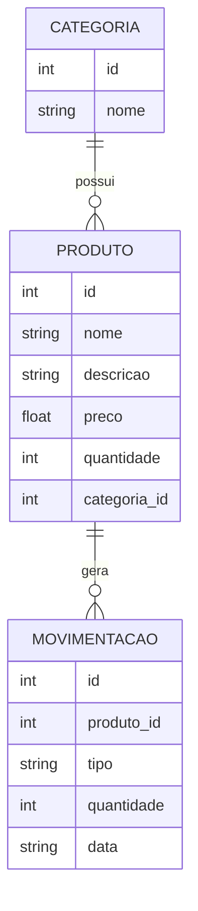

# API de Gestão de Estoque

API RESTful em **Python (Flask)** para gerenciar categorias, produtos e
movimentações de estoque (entradas e saídas), com persistência em
**SQL (SQLite)**. Projeto de portfólio criado para demonstrar, na
prática: consultas SQL, modelagem relacional, Programação Orientada a
Objetos (POO) e Clean Code em um back-end estruturado.

## Modelagem relacional



- **Categoria (1) → Produto (N)**: cada produto pertence a uma categoria.
- **Produto (1) → Movimentação (N)**: cada movimentação (entrada/saída)
  pertence a um produto e atualiza automaticamente seu saldo.

## Arquitetura

```
app/
  models/       # Repositórios: todo o SQL parametrizado vive aqui
  services/     # Regras de negócio (ex.: validar estoque antes da saída)
  routes/       # Blueprints Flask: só HTTP, sem SQL
  database.py   # Conexão e schema (DDL)
  exceptions.py # Exceções de domínio (404, 400, 409)
tests/          # Testes automatizados (unittest), 17 casos
run.py          # Ponto de entrada da aplicação
```

Separar essas camadas é o que permite trocar SQLite por PostgreSQL, por
exemplo, sem tocar em rotas ou regras de negócio — só o `database.py`
mudaria.

## Endpoints

| Método | Rota | Descrição |
|---|---|---|
| GET | `/api/health` | Verifica se a API está de pé |
| POST | `/api/categorias` | Cria categoria |
| GET | `/api/categorias` | Lista categorias |
| GET | `/api/categorias/<id>` | Busca categoria por id |
| PUT | `/api/categorias/<id>` | Atualiza categoria |
| DELETE | `/api/categorias/<id>` | Remove categoria (409 se houver produtos) |
| POST | `/api/produtos` | Cria produto |
| GET | `/api/produtos?categoria_id=` | Lista produtos (filtro opcional) |
| GET | `/api/produtos/<id>` | Busca produto por id |
| PUT | `/api/produtos/<id>` | Atualiza produto |
| DELETE | `/api/produtos/<id>` | Remove produto |
| GET | `/api/produtos/<id>/movimentacoes` | Histórico de um produto |
| POST | `/api/movimentacoes` | Registra entrada/saída (atualiza estoque) |
| GET | `/api/movimentacoes` | Lista todas as movimentações |

## Como rodar localmente

```bash
python -m venv .venv
source .venv/bin/activate          # Windows: .venv\Scripts\activate
pip install -r requirements.txt
python run.py                      # sobe em http://localhost:5000
```

Exemplo de uso com `curl`:

```bash
curl -X POST http://localhost:5000/api/categorias \
  -H "Content-Type: application/json" -d '{"nome": "Informática"}'

curl -X POST http://localhost:5000/api/produtos \
  -H "Content-Type: application/json" \
  -d '{"nome": "Notebook", "preco": 3500, "quantidade": 5, "categoria_id": 1}'

curl -X POST http://localhost:5000/api/movimentacoes \
  -H "Content-Type: application/json" \
  -d '{"produto_id": 1, "tipo": "saida", "quantidade": 2}'
```

## Testes automatizados

```bash
python -m unittest discover -s tests -v
```

17 testes cobrindo CRUD de categorias e produtos, e as regras de
negócio de movimentação (entrada aumenta estoque, saída diminui,
saída maior que o saldo retorna 409, tipo inválido retorna 400).

## Rodando com Docker

```bash
docker build -t estoque-api .
docker run -p 5000:5000 -v estoque_data:/app/data estoque-api
```

## Deploy em nuvem (AWS EC2 / GCP Compute Engine — free tier)

1. Suba uma instância gratuita (AWS `t2.micro`/`t3.micro` ou GCP
   `e2-micro`) com Ubuntu.
2. Acesse via SSH e instale o Docker: `curl -fsSL https://get.docker.com | sh`.
3. Copie o projeto para a instância (`git clone` ou `scp`).
4. Rode `docker build -t estoque-api .` e depois
   `docker run -d -p 80:5000 estoque-api`.
5. Libere a porta 80 (ou 5000) no security group / firewall da instância.
6. Acesse `http://<ip-publico-da-instancia>/api/health` para confirmar.
